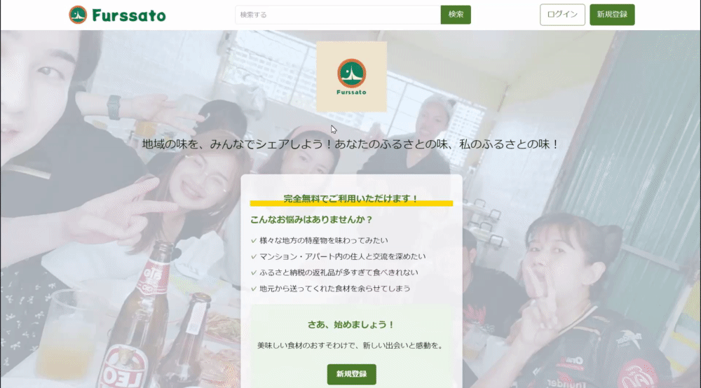
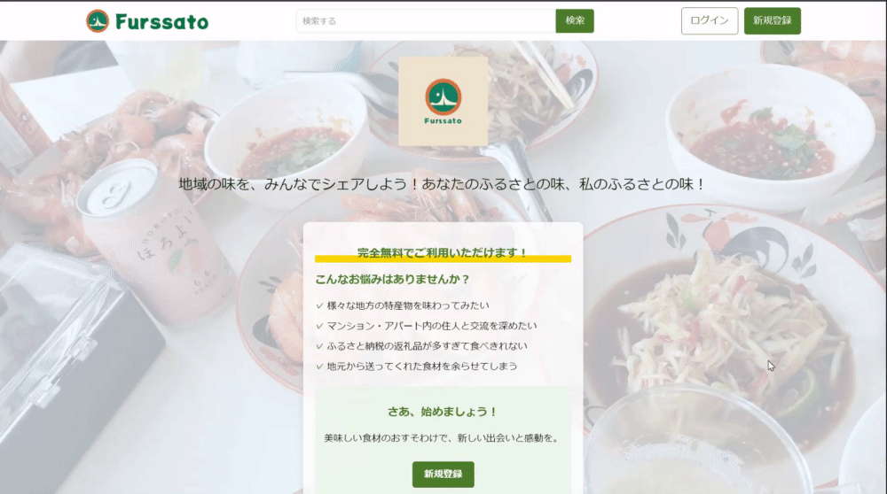
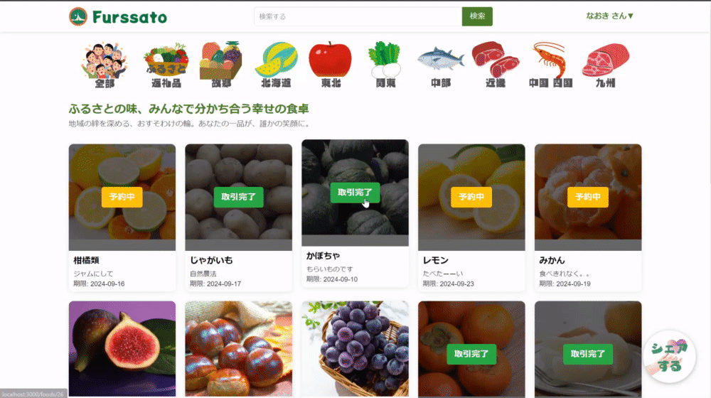
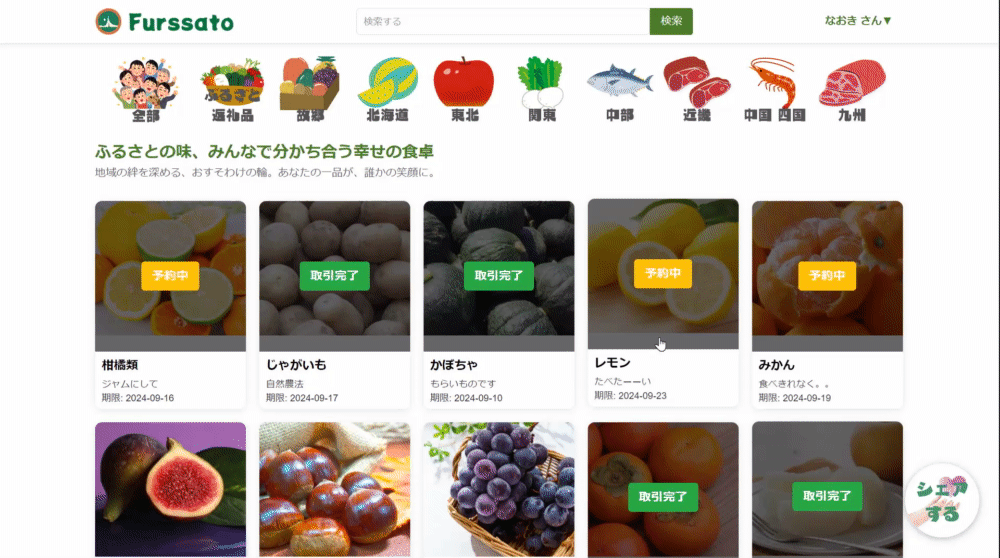
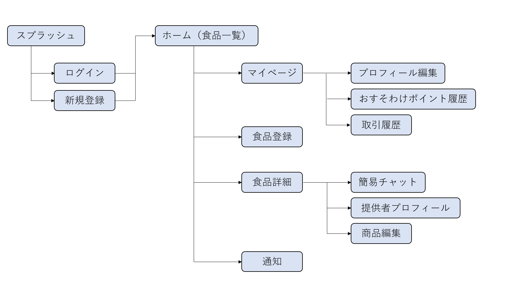

# アプリケーション名
Furusato Share

# アプリケーション概要
ふるさと納税返礼品や故郷の食材をシェアすることができる

# ＵＲＬ
https://furusato-share-41311.onrender.com/splashes

# テスト用アカウント
・Bacic認証パスワード ：admin

・Bacic認証ID : 2222

・メールアドレス : test@mail.com

・パスワード : test123456 

# 利用方法
1.スプラッシュ画面のヘッダーにある「新規登録」ボタンをクリックし、ユーザー登録を行う（又はログインを行う）

2．食材・食品をシェアする
トップページから「シェアする」ボタンをクリックし、食材・食品登録する

3．食材・食品をシェアしてもらう
トップページから任意の食材・食品画像をクリックし、詳細ページから「予約する」ボタンにて予約する

4.トップページからマイページをクリックし、マイページを確認する

5.トップページから任意の上段の画像をクリックし、食品・食品をソートする

# アプリケーションを作成した背景
私は青森県の出身で、上京して一人暮らしを始めました。都会での生活は便利な反面、近所付き合いの希薄さを感じていました。故郷では、野菜や手作り料理のおすそ分けが日常的で、それが地域のつながりを深めていました。
一方、都会での一人暮らしでは、食材の使い切りに苦労し、特にふるさと納税で得た地元の特産品や実家からの贈り物が無駄になることが多くありました。また、集合住宅では隣人とほとんど交流がなく、閉鎖的な環境に居心地の悪さを感じていました。
これらの経験から、食品ロスの削減と住民同士の交流促進を同時に解決できないかと考えました。ふるさと納税や故郷からの贈り物を共有することで、食品を無駄にせず、同時に住民同士の自然な交流のきっかけを作れるのではないか。
そこで、同じ建物内の住民間で食品を共有できるアプリケーションを開発しました。このアプリを通じて、都市部でも適度な近所付き合いを実現し、食品ロスを減らしながら、多様な地域の味を楽しめる環境を作りたいと考えています。

# 実装予定の機能
・チャット機能

# データベース設計
## テーブル設計

## users テーブル
| Column             | Type    | Options     |
| ------------------ | ------  | ----------- |
| nickname           | string  | null: false |
| email              | string  | null: false ,unique: true |
| encrypted_password | string  | null: false |
| name               | string  | null: false |
| name_kana          | string  | null: false |
| birth_date         | data    | null: false |
| room_number        | string  | null: false |
| allergies          | text    |             |
| preferences        | text    |             |
| share_count        | integer | null: false ,default 0|

### Association

- has_many :foods
  has_many :points
  has_many :provided_transactions, class_name: 'Transaction', foreign_key: 'provider_id'
- has_many :received_transactions, class_name: 'Transaction', foreign_key: 'receiver_id'

## foods テーブル
| Column                 | Type       | Options     |
| ---------------------- | ---------- | ----------- |
| name                   | string     | null: false |
| description            | text       |             |
| quantity               | integer    | null: false |
| expiration_date        | date       | null: false |
| allergen_info          | text       | null: false |
| category_id            | integer    | null: false |
| furusato_id            | integer    | null: false |
| status                 | integer    | null: false ,default 0 |
| available_from         | datetime   | null: false |
| available_until        | datetime   | null: false |
| pickup_location_id     | integer    | null: false |
| user                   | references | null: false, foreign_key:true |

### Association

- belongs_to :user
- has_one_attached :image
- has_many :transactions
- belongs_to_active_hash  :category
- belongs_to_active_hash  :furusato
- belongs_to :pickup_location

## Transaction テーブル
| Column       | Type         | Options                        |
| ------------ | ----------   | ------------------------------ |
| provider     | references   | null: false, foreign_key: true |
| receiver     | references   | null: false, foreign_key: true |
| status       | string       | null: false ,default 0         |
| datetime     | completed_at |                                |
| references   | references   | null: false, foreign_key: true |

### Association

- belongs_to :food
- belongs_to :provider, class_name: 'User'
- belongs_to :receiver, class_name: 'User'
- has_many   :points

## Point テーブル
| Column        | Type       | Options                        |
| ------------- | ---------- | ------------------------------ |
| transaction   | references | null: false, foreign_key: true |
| point_type    | integer    | null: false                    |
| user          | references | null: false                    |
| amount        | string     | null: false                    |
| building      | integer    |                                |

### Association
- belongs_to :food_transaction, class_name: 'Transaction', foreign_key: 'transaction_id'
- belongs_to :user

# 画面遷移図

# 開発環境
・プログラミング言語：Ruby

・フレームワーク：Ruby on Rails

・データベース：MySQL

# ローカルでの動作環境
以下のコマンドを順に実行

git clone https://github.com/Nao199/furusato-share

% cd furusato-share

% rm -rf .git

# 工夫したポイント

# 改善点

# 制作時間
4日